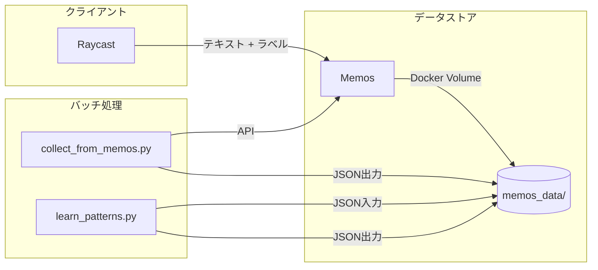
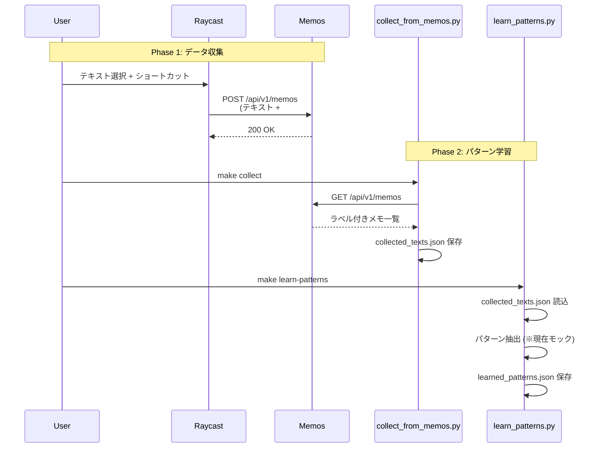

# Architecture

## 概要

ユーザーがラベル付けした文章データから、「AI感」を感じる文章の特徴を抽出・言語化するシステム。

## システム構成



## データフロー



## ディレクトリ構成

```
quick-send/
├── client/
│   └── raycast.rb          # Raycast スクリプト
├── scripts/
│   ├── collect_from_memos.py   # データ収集
│   └── learn_patterns.py       # パターン学習
├── prompts/
│   ├── system.md               # システムプロンプト
│   └── pattern_learning.md     # パターン学習プロンプト
├── memos_data/
│   ├── collected_texts.json    # 収集データ
│   └── learned_patterns.json   # 学習結果
├── compose.yml                 # Docker Compose (Memos)
└── Makefile                    # コマンド定義
```

## コンポーネント詳細

### 1. Raycast スクリプト (`client/raycast.rb`)

- 選択テキストを取得
- ドロップダウンでラベル選択 (👎 AI感 / 👍 好き)
- Memos API にハッシュタグ付きで投稿

### 2. データ収集 (`scripts/collect_from_memos.py`)

- Memos API からメモ一覧を取得
- `#ai_bad` / `#good` タグでフィルタリング
- `memos_data/collected_texts.json` に保存

### 3. パターン学習 (`scripts/learn_patterns.py`)

- 収集データを読み込み
- プロンプトを生成（`prompts/pattern_learning.md`）
- AI API でパターン抽出 (**現在はモック**)
- `memos_data/learned_patterns.json` に保存

## 環境変数

| 変数名         | 説明                     | デフォルト              |
| -------------- | ------------------------ | ----------------------- |
| `MEMOS_URL`    | Memos API エンドポイント | `http://localhost:5230` |
| `ACCESS_TOKEN` | Memos アクセストークン   | -                       |

## コマンド一覧

| コマンド                 | 説明                       |
| ------------------------ | -------------------------- |
| `make up`                | Memos を起動               |
| `make down`              | Memos を停止               |
| `make collect`           | データ収集                 |
| `make learn-patterns`    | パターン学習               |
| `make cp-raycast-script` | Raycast スクリプトをコピー |

## 今後の拡張

1. **AI API 統合**: Google ADK (Gemini) でリアルなパターン抽出
2. **Raycast からの学習起動**: バックエンド API サーバー追加
3. **ファインチューニング**: Vertex AI で大規模データ対応
