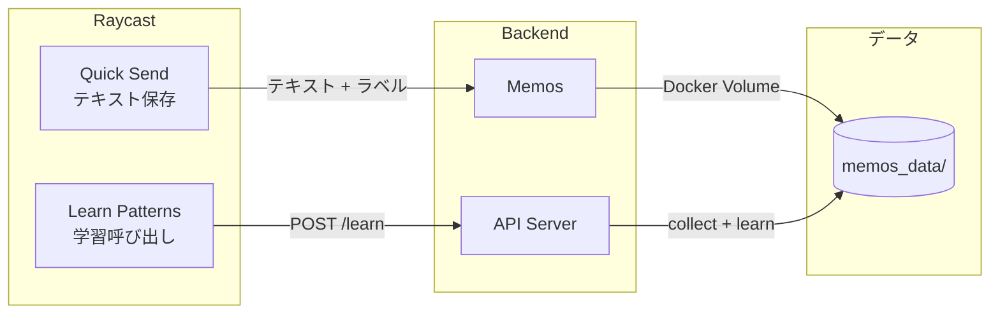
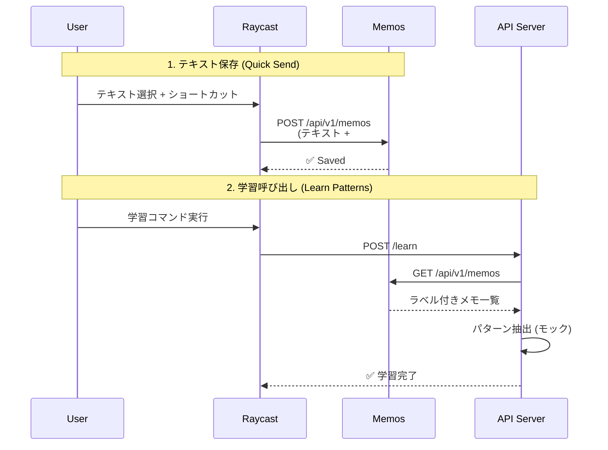

# Architecture

## 概要

ユーザーがラベル付けした文章データから、「AI感」を感じる文章の特徴を抽出・言語化するシステム。

## システム構成



## データフロー



## ディレクトリ構成

```
quick-send/
├── client/
│   ├── quick-send.rb       # テキスト保存 (Raycast)
│   └── learn-patterns.rb   # 学習呼び出し (Raycast)
├── server/
│   └── app.py              # API サーバー
├── scripts/
│   ├── collect_from_memos.py
│   └── learn_patterns.py
├── prompts/
│   ├── system.md
│   └── pattern_learning.md
├── memos_data/
│   ├── collected_texts.json
│   └── learned_patterns.json
└── compose.yml             # Memos + API Server
```

## コンポーネント詳細

### Raycast スクリプト

| スクリプト          | 機能                                 |
| ------------------- | ------------------------------------ |
| `quick-send.rb`     | 選択テキスト + ラベルを Memos に保存 |
| `learn-patterns.rb` | API サーバーに学習リクエスト         |

### API Server (`server/app.py`)

| エンドポイント  | 説明                            |
| --------------- | ------------------------------- |
| `POST /learn`   | collect + learn-patterns を実行 |
| `GET /patterns` | 学習済みパターンを取得          |

## 環境変数

| 変数名         | 説明                     | デフォルト              |
| -------------- | ------------------------ | ----------------------- |
| `MEMOS_URL`    | Memos API エンドポイント | `http://localhost:5230` |
| `ACCESS_TOKEN` | Memos アクセストークン   | -                       |

## コマンド一覧

| コマンド                 | 説明                       |
| ------------------------ | -------------------------- |
| `make up`                | Memos + API Server を起動  |
| `make down`              | 停止                       |
| `make cp-raycast-script` | Raycast スクリプトをコピー |

## 今後の拡張

1. **AI API 統合**: Google ADK (Gemini) でリアルなパターン抽出
2. **Raycast からの学習起動**: バックエンド API サーバー追加
3. **ファインチューニング**: Vertex AI で大規模データ対応
