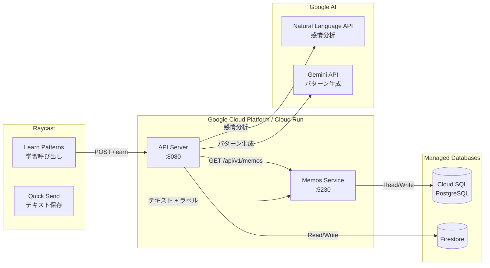
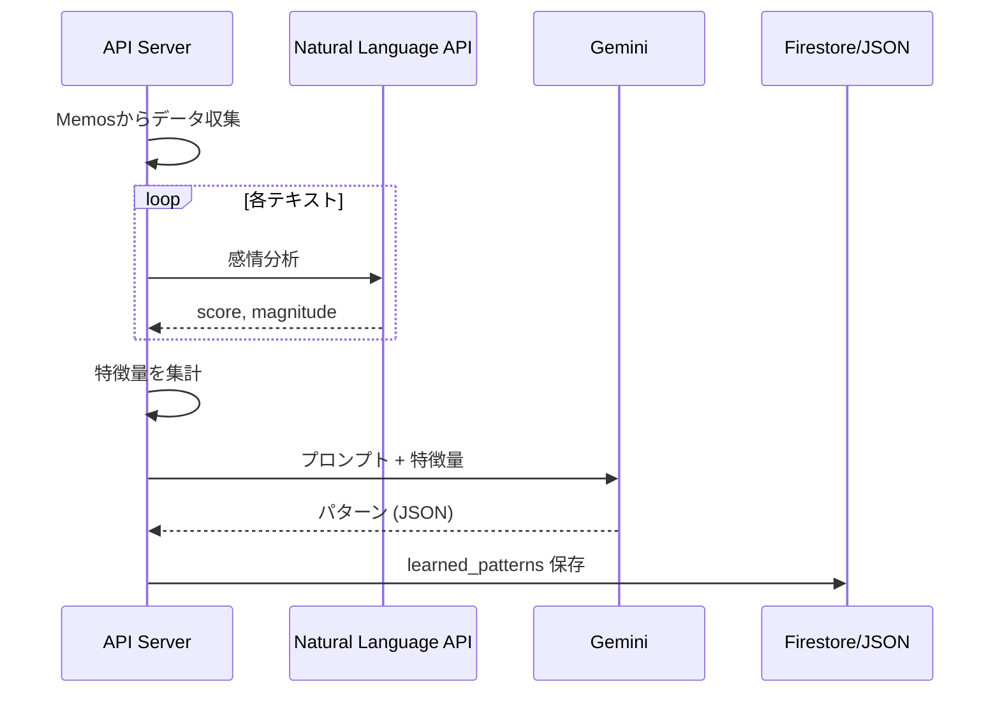

# Architecture

## 概要

ユーザーがラベル付けした文章データから、「AI感」を感じる文章の特徴を抽出・言語化するシステム。

## システム構成

## システム構成



## Firestore 統合とフォールバックメカニズム

Cloud Run への移行に伴い、クラウド環境（ステートレス）とローカル環境（ステートフル/ファイルベース）の両方で API サーバーが動作するように、**ハイブリッド / フォールバック戦略**を実装しています。

### フォールバックロジック

`FirestoreClient` は初期化時に Google Cloud のクレデンシャル（認証情報）を確認します。
- **クレデンシャルがある場合**: Firestore に接続します。
- **クレデンシャルがない場合**: DB接続を行わずに初期化します（ローカルモード）。

データ操作時：
- **書き込み**: Firestore が利用できない場合、データはローカルファイルシステムの `memos_data/*.json` に保存されます。
- **読み込み**: Firestore が利用できない、またはデータが空の場合、システムはローカルの `memos_data/*.json` ファイルからの読み込みを試みます。

これにより、Google Cloud 環境が完全に構成される前でも、既存の JSON データを使用してローカルでの開発を継続できます。

## 学習パイプライン



## ディレクトリ構成

```
quick-send/
├── client/
│   ├── raycast.rb          # テキスト保存 (Raycast)
│   └── learn-patterns.rb   # 学習呼び出し (Raycast)
├── server/
│   ├── app.py              # API サーバー
│   ├── nl_api.py           # Natural Language API クライアント
│   ├── gemini.py           # Gemini API クライアント
│   └── firestore_client.py # Firestore クライアント (New)
├── prompts/
│   ├── system.md
│   └── pattern_learning.md
├── memos_data/
│   ├── collected_texts.json # ローカルフォールバック用
│   └── learned_patterns.json # ローカルフォールバック用
└── compose.yml
```

## API エンドポイント

| メソッド | パス        | 説明                      |
| -------- | ----------- | ------------------------- |
| POST     | `/collect`  | Memos からデータ収集      |
| POST     | `/learn`    | データ収集 + パターン学習 |
| GET      | `/patterns` | 学習済みパターンを取得    |
| GET      | `/health`   | ヘルスチェック            |

## 環境変数

| 変数名                 | 説明                     | デフォルト     |
| ---------------------- | ------------------------ | -------------- |
| `MEMOS_URL`            | Memos API エンドポイント | localhost:5230 |
| `MEMOS_ACCESS_TOKEN`   | Memos アクセストークン   | -              |
| `GEMINI_API_KEY`       | Gemini API キー          | -              |
| `GEMINI_MODEL`         | 使用モデル               | 2.5-flash      |
| `ENABLE_NL_API`        | NL API を有効化          | false          |
| `GOOGLE_CLOUD_PROJECT` | GCP プロジェクト ID      | -              |

## Gemini モデル

| キー      | モデル名                     |
| --------- | ---------------------------- |
| 2.0-flash | gemini-2.0-flash             |
| 2.5-flash | gemini-2.5-flash             |
| 2.5-pro   | gemini-2.5-pro-preview-06-05 |
| 3.0-pro   | gemini-3.0-pro-preview       |

## コマンド

| コマンド                  | 説明                       |
| ------------------------- | -------------------------- |
| `make up`                 | 起動                       |
| `make down`               | 停止                       |
| `make logs`               | API ログ表示               |
| `make collect`            | データ収集                 |
| `make learn`              | パターン学習               |
| `make patterns`           | パターン表示               |
| `make cp-raycast-scripts` | Raycast スクリプトをコピー |
