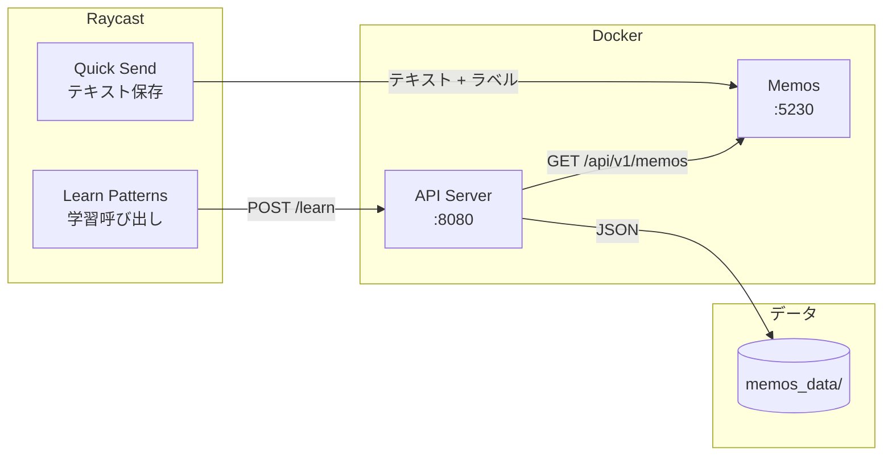
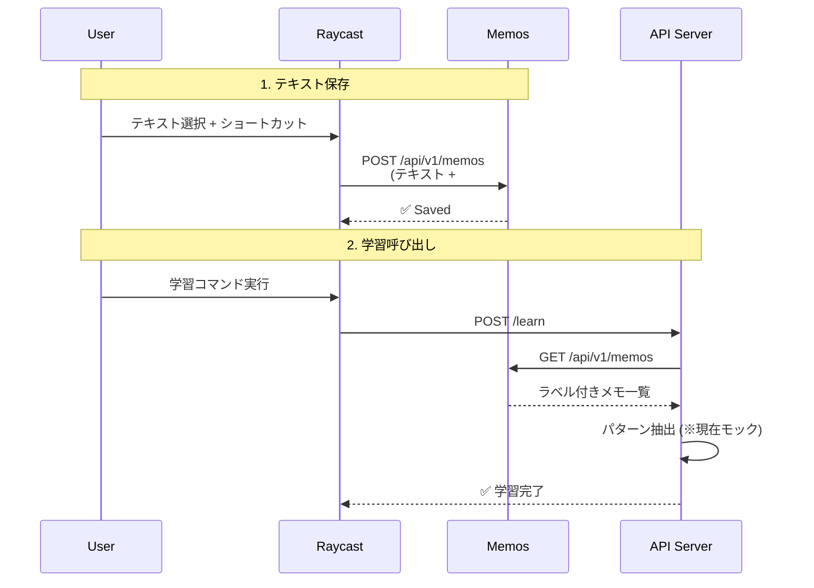

# Architecture

## 概要

ユーザーがラベル付けした文章データから、「AI感」を感じる文章の特徴を抽出・言語化するシステム。

## システム構成



## データフロー



## ディレクトリ構成

```
quick-send/
├── client/
│   ├── raycast.rb          # テキスト保存 (Raycast)
│   └── learn-patterns.rb   # 学習呼び出し (Raycast)
├── server/
│   └── app.py              # API サーバー (collect + learn 統合)
├── prompts/
│   ├── system.md
│   └── pattern_learning.md
├── memos_data/
│   ├── collected_texts.json
│   └── learned_patterns.json
└── compose.yml
```

## API エンドポイント

| メソッド | パス        | 説明                      |
| -------- | ----------- | ------------------------- |
| POST     | `/collect`  | Memos からデータ収集      |
| POST     | `/learn`    | データ収集 + パターン学習 |
| GET      | `/patterns` | 学習済みパターンを取得    |
| GET      | `/health`   | ヘルスチェック            |

## 環境変数

| 変数名               | 説明                     | デフォルト              |
| -------------------- | ------------------------ | ----------------------- |
| `MEMOS_URL`          | Memos API エンドポイント | `http://localhost:5230` |
| `MEMOS_ACCESS_TOKEN` | Memos アクセストークン   | -                       |

## コマンド

| コマンド                  | 説明                       |
| ------------------------- | -------------------------- |
| `make up`                 | 起動                       |
| `make down`               | 停止                       |
| `make logs`               | API ログ表示               |
| `make collect`            | データ収集                 |
| `make learn`              | パターン学習               |
| `make patterns`           | パターン表示               |
| `make cp-raycast-scripts` | Raycast スクリプトをコピー |
