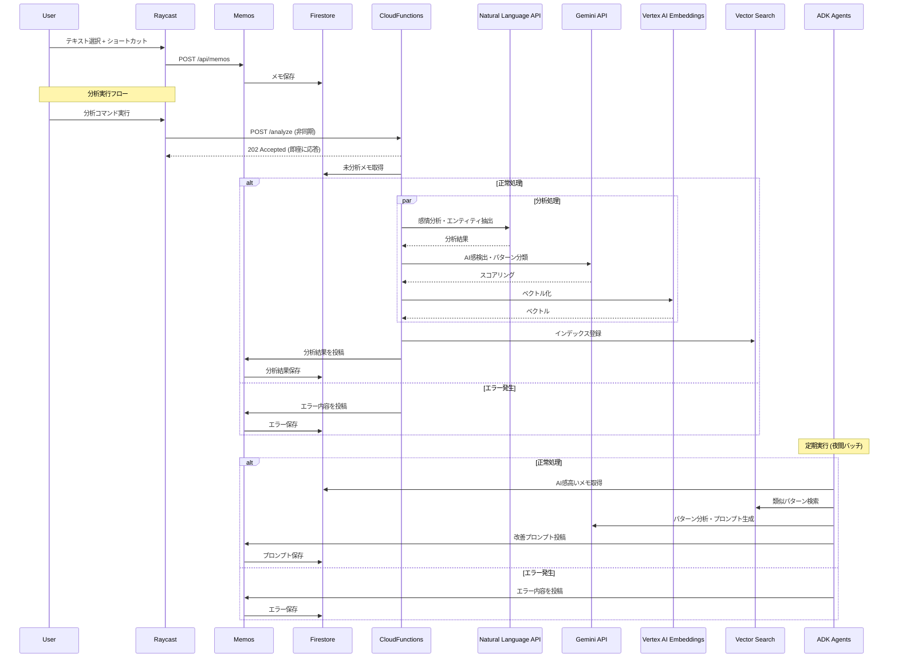
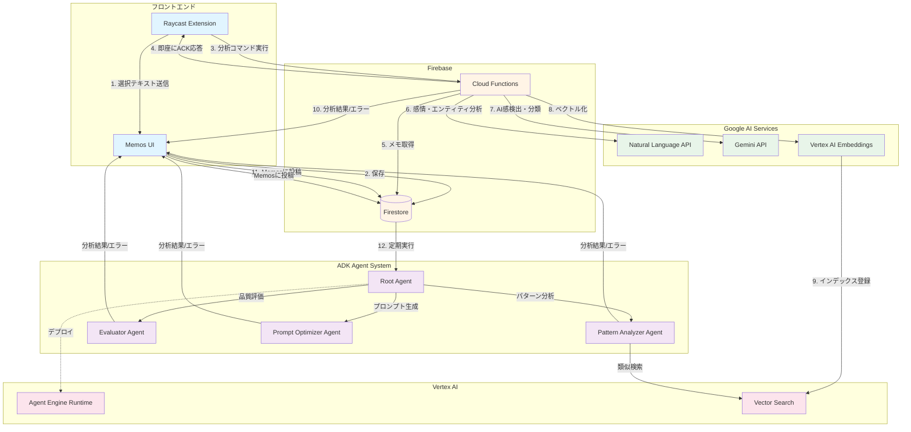

```mermaid
sequenceDiagram
    participant User
    participant Raycast
    participant Memos
    participant Firestore
    participant CloudFunctions
    participant NL as Natural Language API
    participant Gemini as Gemini API
    participant Embeddings as Vertex AI Embeddings
    participant VectorSearch as Vector Search
    participant ADK as ADK Agents
    
    User->>Raycast: テキスト選択 + ショートカット
    Raycast->>Memos: POST /api/memos
    Memos->>Firestore: メモ保存
    
    Note over User,Raycast: 分析実行フロー
    User->>Raycast: 分析コマンド実行
    Raycast->>CloudFunctions: POST /analyze (非同期)
    CloudFunctions-->>Raycast: 202 Accepted (即座に応答)
    
    CloudFunctions->>Firestore: 未分析メモ取得
    
    alt 正常処理
        par 分析処理
            CloudFunctions->>NL: 感情分析・エンティティ抽出
            NL-->>CloudFunctions: 分析結果
            CloudFunctions->>Gemini: AI感検出・パターン分類
            Gemini-->>CloudFunctions: スコアリング
            CloudFunctions->>Embeddings: ベクトル化
            Embeddings-->>CloudFunctions: ベクトル
        end
        
        CloudFunctions->>VectorSearch: インデックス登録
        CloudFunctions->>Memos: 分析結果を投稿
        Memos->>Firestore: 分析結果保存
    else エラー発生
        CloudFunctions->>Memos: エラー内容を投稿
        Memos->>Firestore: エラー保存
    end
    
    Note over ADK: 定期実行 (夜間バッチ)
    
    alt 正常処理
        ADK->>Firestore: AI感高いメモ取得
        ADK->>VectorSearch: 類似パターン検索
        ADK->>Gemini: パターン分析・プロンプト生成
        ADK->>Memos: 改善プロンプト投稿
        Memos->>Firestore: プロンプト保存
    else エラー発生
        ADK->>Memos: エラー内容を投稿
        Memos->>Firestore: エラー保存
    end
```

```mermaid
graph TB
    subgraph "フロントエンド"
        A[Raycast Extension]
        B[Memos UI]
    end
    
    subgraph "Firebase"
        C[(Firestore)]
        D[Cloud Functions]
    end
    
    subgraph "Google AI Services"
        E[Natural Language API]
        F[Gemini API]
        G[Vertex AI Embeddings]
    end
    
    subgraph "ADK Agent System"
        H[Pattern Analyzer Agent]
        I[Evaluator Agent]
        J[Prompt Optimizer Agent]
        K[Root Agent]
    end
    
    subgraph "Vertex AI"
        L[Agent Engine Runtime]
        M[Vector Search]
    end
    
    A -->|1. 選択テキスト送信| B
    B -->|2. 保存| C
    
    A -->|3. 分析コマンド実行| D
    D -->|4. 即座にACK応答| A
    D -->|5. メモ取得| C
    D -->|6. 感情・エンティティ分析| E
    D -->|7. AI感検出・分類| F
    D -->|8. ベクトル化| G
    G -->|9. インデックス登録| M
    D -->|10. 分析結果/エラー| B
    B -->|11. Memosに投稿| C
    
    C -->|12. 定期実行| K
    K -->|パターン分析| H
    K -->|品質評価| I
    K -->|プロンプト生成| J
    H -->|類似検索| M
    H & I & J -->|分析結果/エラー| B
    B -->|Memosに投稿| C
    
    K -.->|デプロイ| L
    
    style A fill:#e1f5ff
    style B fill:#e1f5ff
    style C fill:#fff4e6
    style D fill:#fff4e6
    style E fill:#e8f5e9
    style F fill:#e8f5e9
    style G fill:#e8f5e9
    style H fill:#f3e5f5
    style I fill:#f3e5f5
    style J fill:#f3e5f5
    style K fill:#f3e5f5
    style L fill:#fce4ec
    style M fill:#fce4ec
```