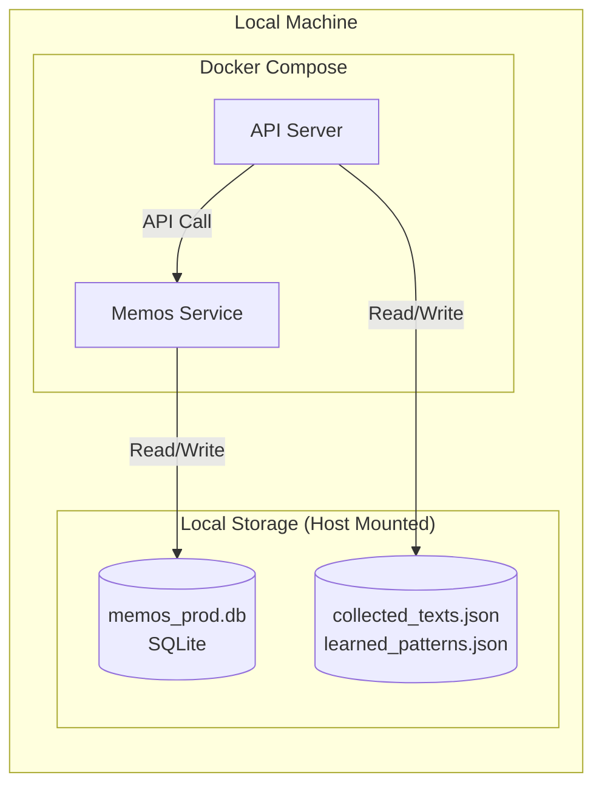
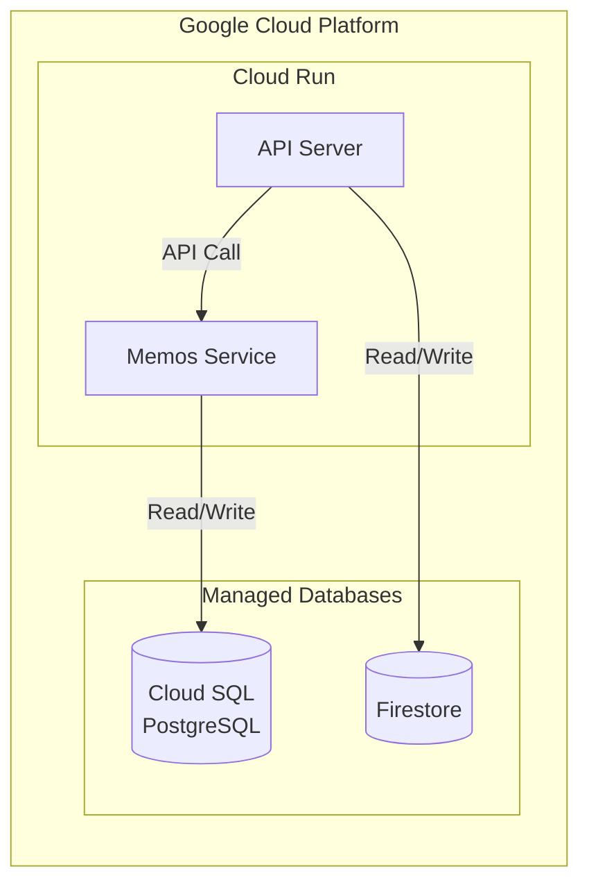

# Cloud Run 移行と Firestore 統合計画

Local ファイルシステムに依存している `quick-send` API サーバーのデータを Google Cloud Firestore に移行し、Cloud Run 上でのステートレスな運用を実現します。

## アーキテクチャの変更

### 変更前 (Current: Local Docker Compose)
現状は全てのデータがローカルファイルシステム上に存在します。

### 変更後 (Proposed: Cloud Run)
Cloud Run はステートレス（再起動でデータが消える）な環境であるため、データの保存先を外部のマネージドサービスに切り替える必要があります。

## なぜ Cloud SQL が必要で、BigQuery は適していないのですか？

> [!WARNING]
> **結論: Memos サービスには BigQuery は使用できません。Cloud SQL (PostgreSQL/MySQL) が必須です。**

理由はアプリケーションの特性とデータベースの用途の違いにあります。

| 特徴            | Cloud SQL (PostgreSQL)                                                                                               | BigQuery                                                                                          |
| :-------------- | :------------------------------------------------------------------------------------------------------------------- | :------------------------------------------------------------------------------------------------ |
| **主な用途**    | **OLTP (オンライントランザクション処理)** Webアプリのバックエンド、ユーザー管理、メモの保存など、頻繁な読み書き。 | **OLAP (オンライン分析処理)** 大量データの分析、集計、レポート作成。                           |
| **応答速度**    | **ミリ秒単位** (非常に高速) アプリの画面を瞬時に表示するのに向いています。                                        | **数百ミリ秒〜数秒** 大量データのスキャンには速いが、Webアプリのリアルタイム応答には遅すぎる。 |
| **Memosの対応** | **公式サポート** (SQLite, MySQL, PostgreSQL)                                                                         | **非対応** (そもそも接続できません)                                                               |
| **料金体系**    | 起動時間に対して課金 (24時間稼働なら定額に近い)                                                                      | クエリでスキャンしたデータ量、または保存容量に対して課金                                          |

**要約**:
1.  **Memos 本体は BigQuery に対応していません。** ドライバーが存在せず、アプリが起動しません。
2.  仮に対応していたとしても、BigQuery は「メモを1つ保存する」「一覧を表示する」といったWebアプリの細かい動作には遅すぎて向きません。

### コストを抑えたい場合の Cloud SQL 代替案

Cloud SQL の月額コスト (~$15) がネックとなる場合、以下のクラウドネイティブな構成も検討できますが、セットアップの難易度が上がります。

1.  **SQLite on Cloud Storage FUSE**:
    - Cloud Run サイドカーを使って GCS バケットをファイルシステムとしてマウントし、そこに SQLite ファイル (`memos_prod.db`) を置く方法。
    - **メリット**: ほぼ無料 (GCS料金のみ)。
    - **デメリット**: 同時書き込みに弱く、データベース破損のリスクが完全にはゼロではない（最近はサポートされましたが、設定には注意が必要）。また、Cloud SQL より遅い。

**今回の計画では、安定性とセットアップの容易さから Cloud SQL (または FUSE + SQLite) を推奨しますが、実装作業は「API ServerのFirestore化」に集中します。**

---

## 提案される変更 (詳細)

### Python API サーバー (`server/`)

`DataCollector` と `PatternLearner` におけるローカル JSON ファイル操作を、Firestore クライアント経由のアクセスに置き換えます。

#### [NEW] [firestore_client.py](file:///Users/aobaiwaki/quick-send/server/firestore_client.py)
- Firestore とのやり取りをカプセル化します。
    - `save_collected_texts`: Memos から取得したデータを保存
    - `load_collected_texts`: 分析のためにデータを取得
    - `save_patterns`: 生成されたパターンを保存
    - `load_patterns`: フロントエンド表示用に取得

#### [MODIFY] [data_collector.py](file:///Users/aobaiwaki/quick-send/server/data_collector.py)
- `_save_dataset` (JSON保存) を削除・置換。
- `FirestoreClient` を使用してデータを保存。

#### [MODIFY] [pattern_learner.py](file:///Users/aobaiwaki/quick-send/server/pattern_learner.py)
- `load_dataset` (JSON読み込み) を削除・置換。
- `FirestoreClient` から学習データを取得し、結果を保存。

#### [MODIFY] [api_handler.py](file:///Users/aobaiwaki/quick-send/server/api_handler.py)
- データ取得ロジックを Firestore 経由に変更。

#### [MODIFY] [pyproject.toml](file:///Users/aobaiwaki/quick-send/pyproject.toml)
- `google-cloud-firestore` を依存関係に追加。

### インフラストラクチャ

#### [NEW] [Dockerfile](file:///Users/aobaiwaki/quick-send/Dockerfile)
- API サーバー専用の Dockerfile を作成。

## 検証計画

### 自動テスト
- 現状テストスイートがないため、手動検証を中心に行います。

### 手動検証
1.  **ビルド**: Docker ビルドが成功することを確認します。
2.  **ローカル実行 (Firestore モック/Dev)**:
    - Google Cloud クレデンシャルを使用して、ローカルの Python スクリプトが実際の Firestore プロジェクト（またはエミュレータ）に書き込めるか確認します。
