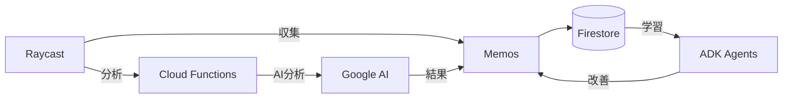
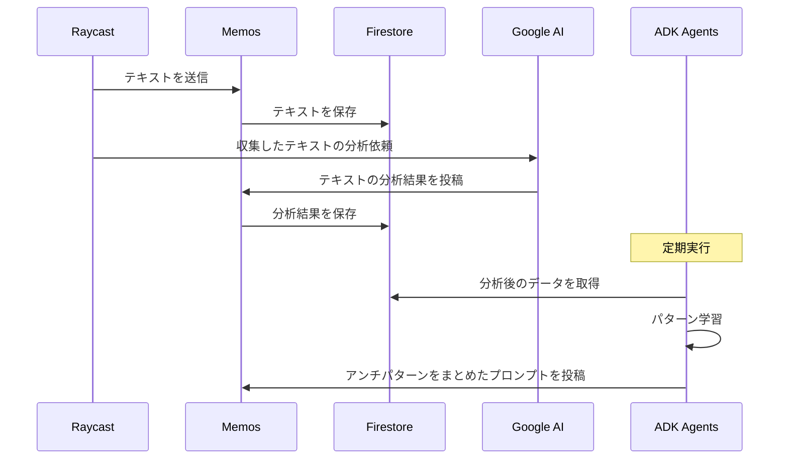

# Raycast × MemosでAI感のある雑な文章を収集する

## Abstract

RaycastとMemosを組み合わせた文章収集ツール

`cmd + i` など、設定したショートカットキーで選択したテキストをMemosに転送する


## Purpose

AI感のある雑な文章を効率的に収集し、アンチパターンとしてAIに投入できるようにする。

## Architecture





## Quick Start

```sh
$ make up
Memos: http://lomakecalhost:5230
```

### Memosのアクセストークンを取得する

Memos左下の「Settings」→「My Account」→「Access Tokens」を選択。

`.env.example`を参考に、`.env`を作成する。

Raycastに拡張スクリプトを追加 (自己責任でお願いします)

```sh
$ make cp-raycast-script
```

## Troubleshooting

### macOS

1. システム設定 を開く。
2. プライバシーとセキュリティ -> アクセシビリティ を開く。
   1. Raycast が ON になっているか確認。
3. プライバシーとセキュリティ -> オートメーション を開く。
   1. Raycast の項目を展開し、System Events が ON になっているか確認。

## Reference

- [Memos - GitHub](https://github.com/usememos/memos)