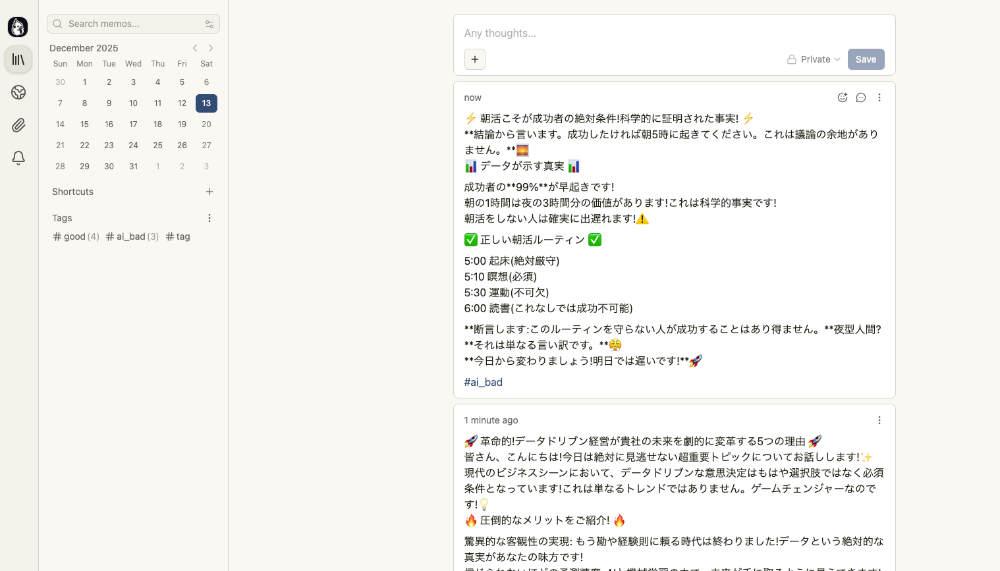

# Raycast × MemosでAI感のある雑な文章を収集する

## Abstract

RaycastとMemosを組み合わせた文章収集ツール

`cmd + i` など、設定したショートカットキーで選択したテキストをMemosに転送する



## Purpose

AI感のある雑な文章を効率的に収集し、アンチパターンとしてAIに投入できるようにする。

## 実装計画

```sh
.
├── data/
│   ├── collected_texts.json      # Memosから収集したラベル付きデータ
│   ├── learned_patterns.json     # AIが学習したパターン
│   └── training.jsonl            # 学習用データ (JSONL形式、オプション)
├── prompts/
│   ├── system.txt                # システムプロンプト
│   ├── pattern_learning.md      # パターン学習用プロンプト
│   └── ai_detection.txt          # AI感検出用プロンプト
├── scripts/
│   ├── collect_from_memos.py     # Memosからデータ収集
│   ├── learn_patterns.py         # ユーザーの判断からパターン学習
│   └── train_model.py            # Vertex AIで学習 (オプション)
├── src/
│   └── agent.py                  # ADK Agent実装 (学習済みパターンベース)
├── .env.example
├── requirements.txt
├── Makefile
└── README.md
```

## Quick Start

```sh
$ make up
Memos: http://lomakecalhost:5230
```

### Memosのアクセストークンを取得する

Memos左下の「Settings」→「My Account」→「Access Tokens」を選択。

`.env.example`を参考に、`.env`を作成する。

Raycastに拡張スクリプトを追加 (自己責任でお願いします)

```sh
$ make cp-raycast-script
```

## Troubleshooting

### macOS

1. システム設定 を開く。
2. プライバシーとセキュリティ -> アクセシビリティ を開く。
   1. Raycast が ON になっているか確認。
3. プライバシーとセキュリティ -> オートメーション を開く。
   1. Raycast の項目を展開し、System Events が ON になっているか確認。

## Reference

- [Memos - GitHub](https://github.com/usememos/memos)