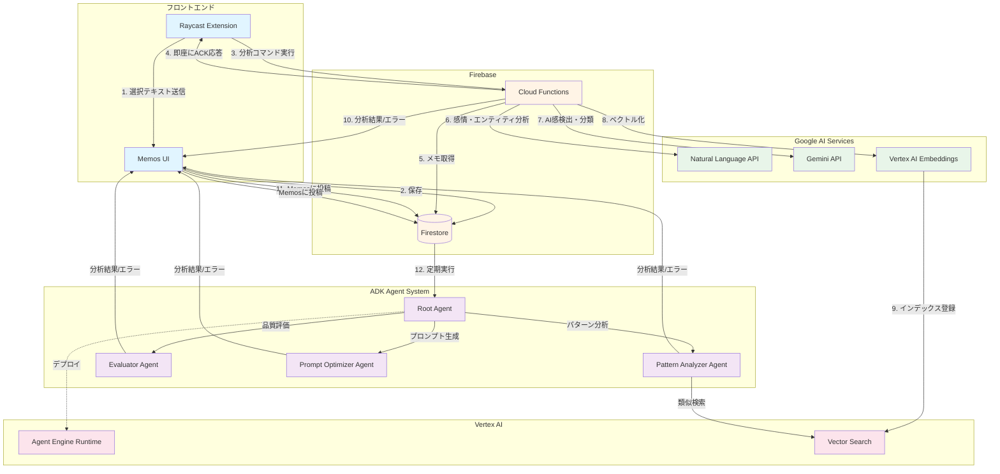

## 指示

以下のmermaidを参考に、アーキテクチャの図を作成してください。
全体的な色合いを意識し、ぱっと見で役割がわかるようにしてください
アイコンがあるものは元々の色を保持してください
矢印は直線でお願いします
灰色、紫は使わないでください
異なるブロックは異なる色を使用してください
背景は無地で真っ白ではない白色にしてください
色合いの組み合わせが補色にならようにしてください
それぞれのブロックと関係性のわかりやすさを意識してください。

## 注意

`A[`のような生成時の文字列が混入することがあるため、必ず除去してください

## アイコン画像

以下を参考にしてください
全体的にシンプルにお願いします

### Raycast

https://www.raycast.com/uploads/redesign/new-appicon.png

### Memos

カラフルでモダンなメモアプリのアイコンを作成してください

## Firestore

https://soichisumi.net/images/firestore.png

### Cloud Functions

https://blog.usize-tech.com/contents/uploads/2022/07/eyecatch-cloudfunctions.png

### Vertex AI

シンプルにしてください

https://ai-market.jp/wp-content/uploads/2024/02/googlecloud-vertexai-960x504-1.webp

### Gemin API

https://images.ctfassets.net/ct0aopd36mqt/wp-thumbnail-6a331d7c70f1897ca2ef1ad4cbe7c6bf/78c556633ae5115aa065636cc4a1160a/eyecatch_gemini?w=1920&fm=webp

### Natural Language API

https://devio2023-media.developers.io/wp-content/uploads/2022/09/googlecloud-cloud-natural-language-api.png

### ADK Agent System

エージェントの数が多いので、それぞれのエージェントはシンプルにしてください
エージェント同士の関係性がわかるようにしてください

### Agent Engine Runtime

Agent Engine Runtimeに沿ったシンプルなアイコンを作成してください

## アーキテクチャ

## 生成後

プロンプトに従えたかどうかを自己評価し、できていない場合はその点を列挙してください