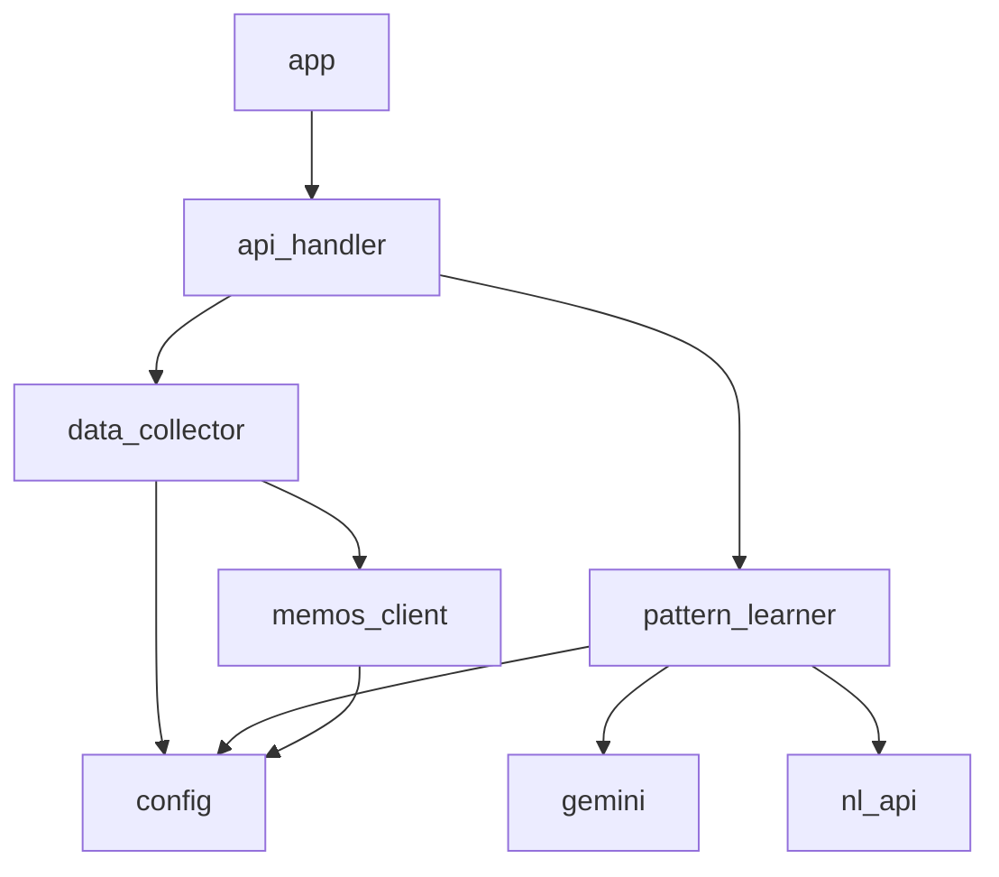

# Server Module

API サーバー - Memosからデータを収集し、AI感パターンを学習する。

## モジュール構成

```
server/
├── app.py              # エントリポイント（サーバー起動）
├── config.py           # 設定・環境変数
├── memos_client.py     # Memos API 連携
├── data_collector.py   # データ収集・保存
├── pattern_learner.py  # パターン学習
├── api_handler.py      # HTTP リクエスト処理
├── gemini.py           # Gemini API クライアント
└── nl_api.py           # Natural Language API クライアント
```

## 依存関係



## API エンドポイント

| Method | Path      | 説明                      |
| ------ | --------- | ------------------------- |
| GET    | /health   | ヘルスチェック            |
| POST   | /collect  | Memosからデータ収集       |
| POST   | /learn    | データ収集 + パターン学習 |
| GET    | /patterns | 学習済みパターン取得      |

## 起動

```bash
python -m server.app
```
